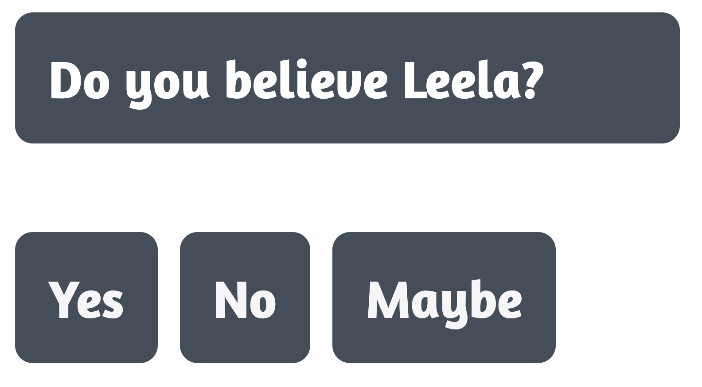
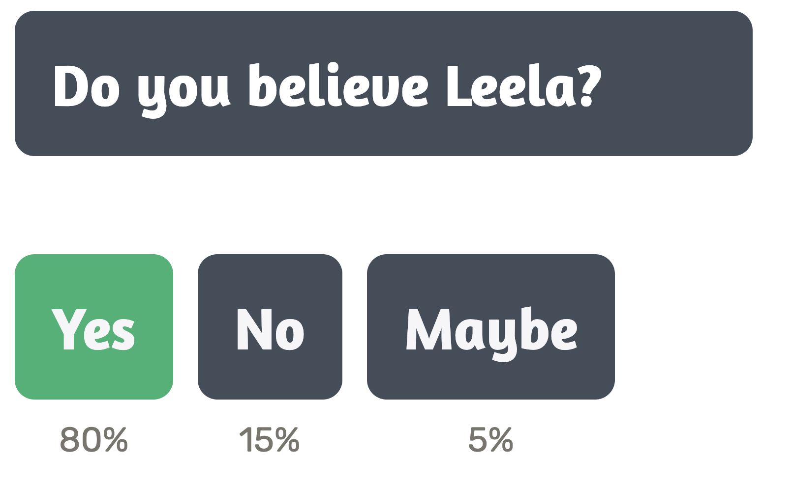
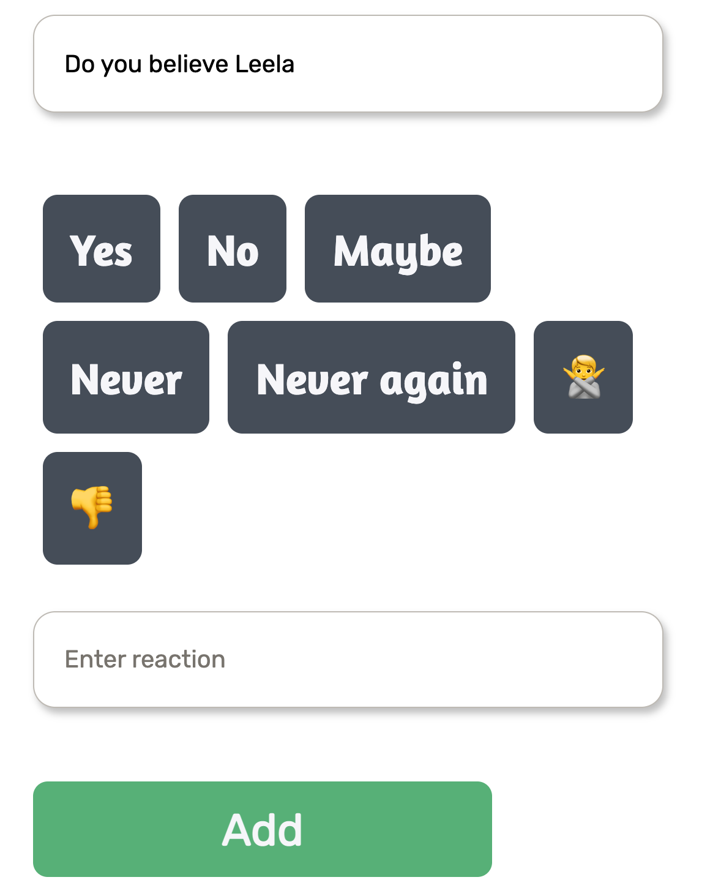
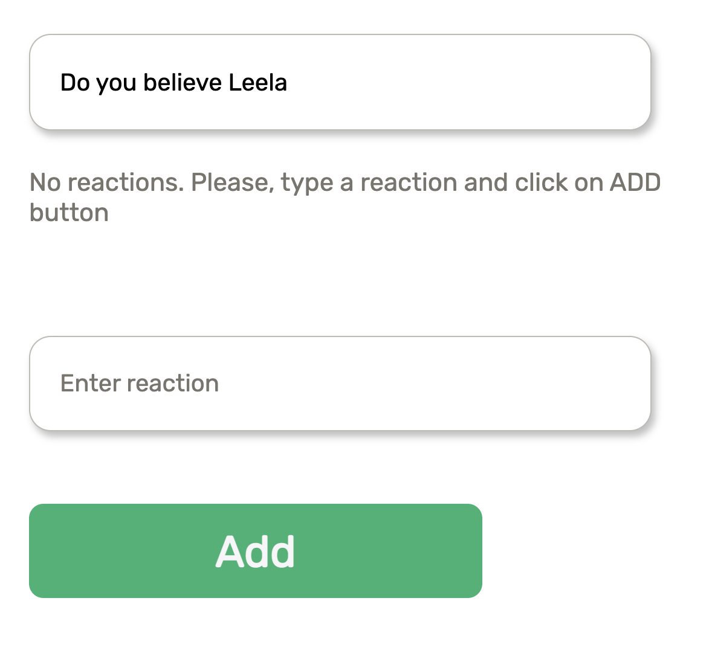

<Spacer />

Hi, 👋 I hope you had a wonderful week

## Intro

This wasn't that productive week, but I've done some progress regarding Thermo English and I'm happy about that

The most complicated UI parts are done and soon it'll be the time to start building infrastructure and backend services

Just heads up. My goal isn't to launch MVP shortly but to make myself a better developer as well. I don't doubt it in my mind. I've decided to step on the path where most people give up. I started this thing and I'm going to go through hell to make it done

By the way, I already encountered a few haters that don't believe in my idea, but the most important thing here is that I believe in this idea and I believe in myself. Isn't it the most vital thing for any idea?

You should remember that when you're trying to go out of mediocrity people will pull your back like crabs in the bucket. They don't want you to succeed. I don't want to be rude, but they're losers by default, they got used to it

I choose the hardest way that's going to pay off 🙏

## Achievements

There are not a lot of them in this week, but the old saying says: _"The road is made by walking; Walking makes the road"._

So, we're going to run 🙂

**QuestionReactions component** — it has two states (answered and non-answered)

<figure>
  
</figure>

<Spacer />

<figure>
  
</figure>

**QuestionBuilder component**

Reactions can be added by using "Enter reaction" input and clicking on the "Add" button

<figure>
  
</figure>

<Spacer />

<figure>
  
</figure>

## Next steps

My focus for this week is to completely implement a generic post page

Why is it gonna be generic? Because the post page has a few states and it's not good to duplicate a lot of code. It breaks DRY principle harshly. This is why it'll be generic

## Off-topic

If you want to keep track of how the project is moving, feel free to visit [Github repo](https://github.com/termoxin/thermo-english). And remember you can always contribute to the project as well. It'll be an immense help for me and the project

If you don't know about ThermoEnglish anything, you can read about it in [this article](/thermo-english-the-best-web-platform-for-learning-english)

## Agenda

I'm fuc\*king close to getting my driving license 🚙

## Conslusion

Despite the previous week wasn't that progressive, this one is gonna be breakthrough

I already feel the scent of win that's closer and closer every day👊

#### Do you think Thermo English is going to be launched at the end of the summer?

Best regards,
Ros ❤️
