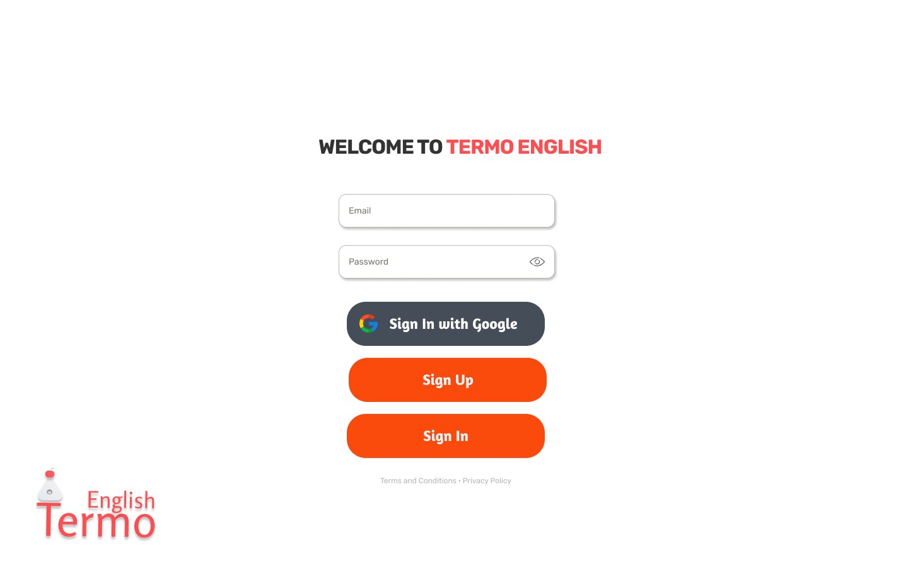
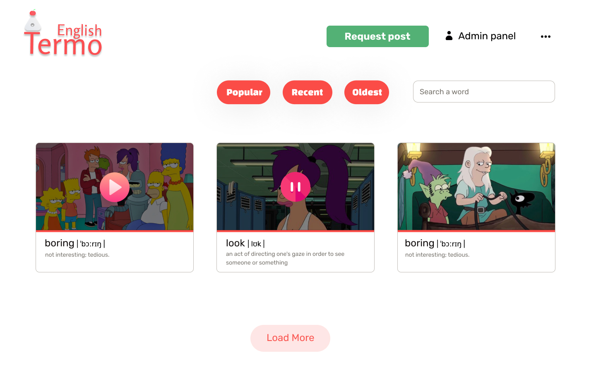

<Divider />

Hi, I'm **Ros**! Nice to meet you stranger 👋

I expect you already know about me and who I am by reading "About
me" page. If you don't, please take a close look at ["About me" page](/about)

<Divider />

## What am I going to write here?

If you've read ["About me"](/about) page previously then you know the purpose of the blog

## What are the next steps?

My current priorities:

- Building web platform for Thermo English project (formerly Termo English because of a misspelling of _thermonuclear_ word) and launching
  it as an MVP on the market
- Documenting my journey in the blog and getting it popular (over 10000 daily visitors)
- Create a community of people that share the same passion for creating things that improve people's lives
- Rest well 🛋

## What can I do to make it done?

- Write at least once a week
- Push at least one significant commit to github repo every day
  - What is _significant commit_? This is something that pushes the project forward. E.g. a feature, improvement of developer experience,
    design improvements and so on
- Rest at least an hour per day fully without thinking about my projects and work
  - It can be playing a video game that makes me happier, going for a stroll, hanging out with friends, and so on
- Promote the blog through Telegram, Google Adsense, Reddit to reach more people

## What do I have at this point?

- Basic MVP designs in Figma. You can see a few screens of the home and posts page below. If you want to contribute and see more, you can always contact me using [Telegram](https://t.me/termoxin).
  Anyway, everything is going to be posted here over time
- Authentication layout is created. It does not include business logic yet. It's just a simple layout. The project is
  on [Github](https://github.com/termoxin/thermo-english) if you have a desire to take a look at it or contribute to it
- I have a desire, energy, and thrive to make it done. I think these are the most important points

<Divider />

<figure>
  
</figure>

<Divider />

<figure>
  
</figure>

<Divider />

## Sprint

What's a sprint? — **It is short, repeatable phases, typically one to four weeks long**

1. It means, I'm gonna have short phases where I'll work on specific goals for 2 weeks. It'll help me to move forward step by step and track my progress
2. It's a good amount of time to get some results and analyze them
3. I'm gonna write some squiggles about sprint results every 2 weeks on Sunday 🌞

### Checklist

1. Create posts page
2. Create a post page
3. Create walkthrough article "Thermo English — the best web platform for learning English online"

I'm going to update the checklist dynamically, so you will able to track my progress as well 😄

I hope you're going to have a great week, see you in the next one ✊
