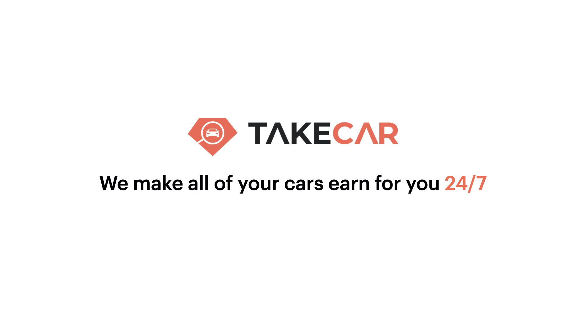

# ❌ FAILED

## 01.08.2023

**Reason:**

1. **Not enough actions**

   - The project was started in the first phase of the war in Ukraine when businesses were not doing well, especially car renting businesses.
   - The international market seemed ready for it, but I didn't put in enough diligence and time to send more cold emails, phone calls, and so on.
   - I had contacts of car rental businesses in Odessa (Ukraine), but I was too afraid to talk with them.

2. **Not enough experience**

   - I didn't know how to launch apps properly. For example, ProductHunt was something I knew about, but I didn't know that it could be used for launching my app.

3. **Gave up too fast**

   - I think this is the main reason for the failure since consistently launching and trying (for a reasonable amount of time, of course) is crucial.

4. **Overwhelmed by VC funding approach**
   - I thought that the only way to get money to make the project going was to get funding. However, as soon as I came across many examples of individuals earning millions of dollars with multiple small startups and zero employees, it completely changed my mindset.

> Thanks a lot my lovely girlfriend ** Nastya ** (bride now) for supporting
> me with this project ❤️ It is time to move on 🚀

## Backstory

A few months I got an idea to create a startup that's gonna help car rental companies to rent their car faster and make them as busy as possible to increase their income and provide people with cars they want. Luckily, I had enough skills to pull it off and my desire and love for cars 💖 were going over the moon, so I decided to start with the name and logo.

Like every single startup in the world, RIGHT ?!

So, of course, before that, I had a lot of procrastination stuff, but now I'm good, so we can proceed. Let the presentation below tell you about the project a bit. By the way, here's the startup [website](https://takecar.co).

## What's TakeCar?

Here's the presentation that's gonna tell you more than a thousand words.

<Carousel
  items={[
    { url: "/presentation/takecar-presentation-slide-1.jpeg" },
    { url: "/presentation/takecar-presentation-slide-2.jpeg" },
    { url: "/presentation/takecar-presentation-slide-3.jpeg" },
    { url: "/presentation/takecar-presentation-slide-4.jpeg" },
    { url: "/presentation/takecar-presentation-slide-5.jpeg" },
    { url: "/presentation/takecar-presentation-slide-6.jpeg" },
    { url: "/presentation/takecar-presentation-slide-7.jpeg" },
  ]}
/>

<Divider />

## What's progress so far?

✅ I’ve created a startup name and logo  
✅ I’ve created a simple website that’s gonna be a great foundation for future application  
✅ I’ve created MVP design for the website with basic features  
✅ I’ve contacted some Dubai car rental companies and one of them already can work with us

<Carousel
  items={[
    {
      url: "/mvp-design/booking-popup-mobile.jpg",
    },
    {
      url: "/mvp-design/booking-popup-tablet.jpg",
    },
    {
      url: "/mvp-design/booking-popup.jpg",
    },
    {
      url: "/mvp-design/car-default.jpg",
    },
    {
      url: "/mvp-design/car-mobile.jpg",
    },
    {
      url: "/mvp-design/car-tablet.jpg",
    },
    {
      url: "/mvp-design/contracts-popup-mobile.jpg",
    },
    {
      url: "/mvp-design/country-popup.jpg",
    },
    {
      url: "/mvp-design/main-mobile.jpg",
    },
    {
      url: "/mvp-design/main-tablet.jpg",
    },
    {
      url: "/mvp-design/ui-kit.jpg",
    },
  ]}
/>

<Spacer />

## What's a plan for June?

❌ Implement MVP design  
❌ Set up CRM/CMS in Notion  
❌ Deploy the project  
❌ Publish first client's (car rental company) cars  
❌ Create social media accounts for TakeCar (Instagram, Facebook, TikTok, Telegram, Youtube)  
❌ Hire assistant to delegate the project tasks  
❌ Make a deal with 5 more companies  
❌ Get a first booking  
❌ Earn first money out of the project

## Summary

I believe in this project, because I love cars and everything that related to them.

Also, I'm looking 🔎 for business partner. So, feel free to contact me in <a href="https://t.me/termoxin" target="_blank">Telegram</a> in case you'd like to join this project.

> Good luck,
>
> Rostyslav

