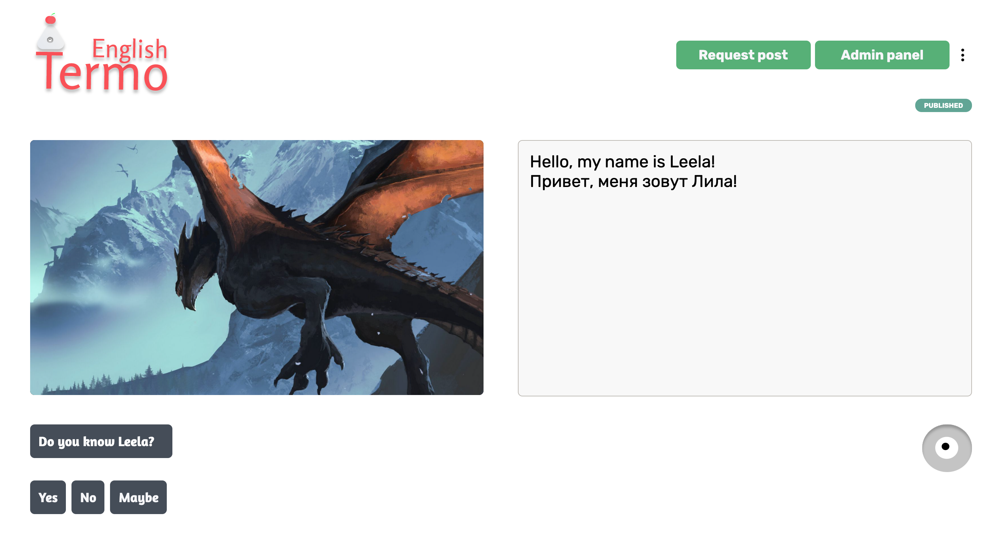
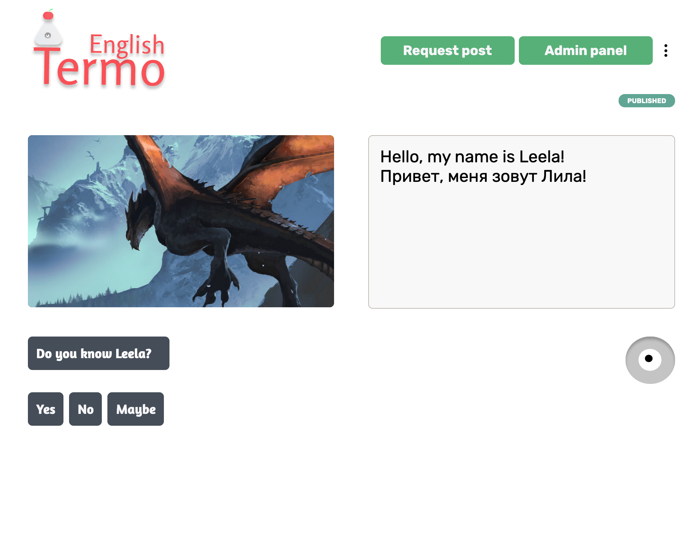
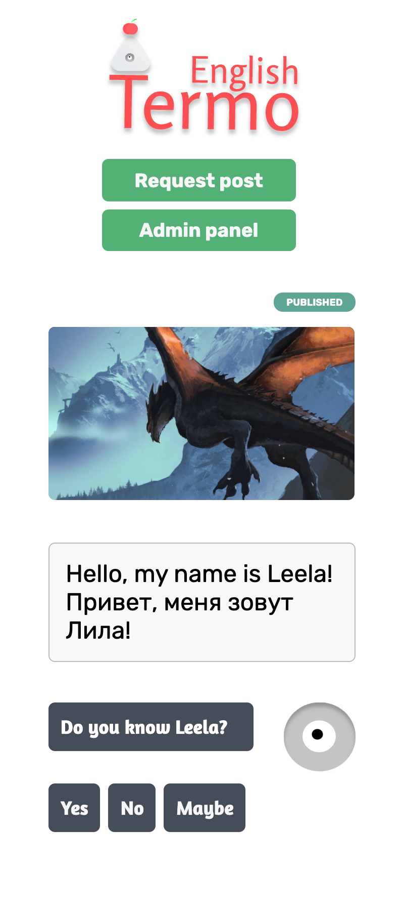
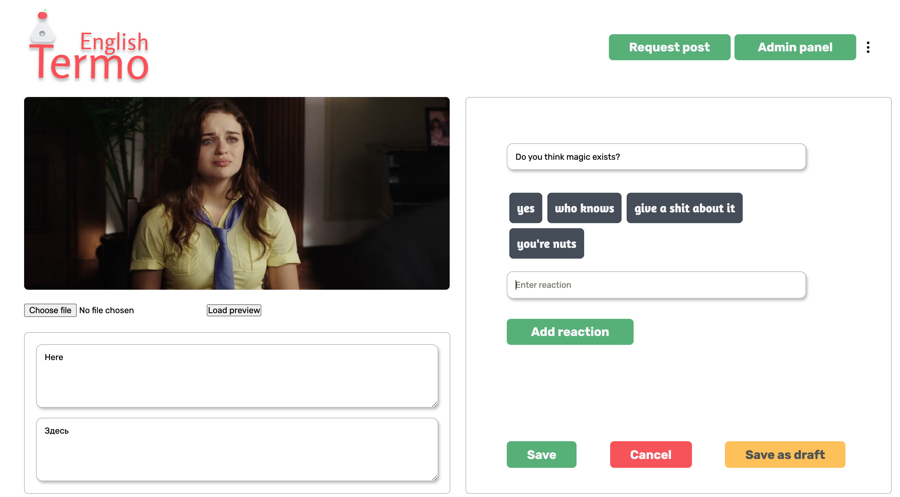
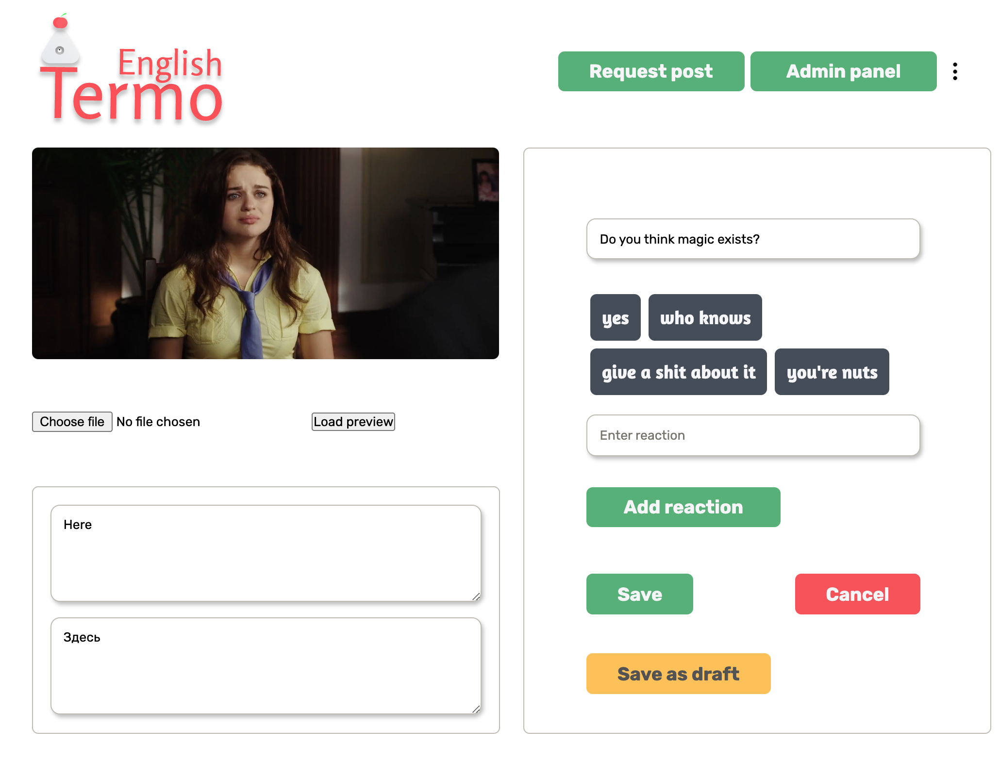
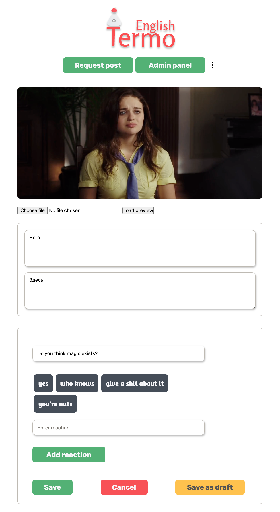

<Spacer />

Hi, 👋 I hope you had an amazing week

## Intro

Even though things didn't settle down yet and dust is still falling on the ground, things are getting better and I'm happy about that. I have a feeling that I'm running on the bridge the broke off. A little bit more efforts and I'm going to be on another side of the abyss

The most important thing here is to have no temptation to fall into the abyss because of my curiousness. Maybe, I'm wired in that way

A little bit of fictional warm-up and we're ready to go to something more real than a broken bridge🌉 in the middle of the abyss

Let get straight into this week's achievements and failures...

## Achievements

I've improved the design of creating a post page because it turned the new design is more convenient and it is easier to make it responsive. It's still quite a row and something is not convenient enough, but it's getting better. I'll allocate some time before release to make UI/UX better for users

I created a post page and create a post page which makes implementing edit post page way easier. If you didn't read the previous post about the purpose of each page I bet you've to read them as well to get more context about things that I'm gonna show you right now and right here

### Post page

<figure>
  
</figure>

<figure>
  
</figure>

<figure>
  
</figure>

### Create post page

<figure>
  
</figure>

<figure>
  
</figure>

<figure>
  
</figure>

I think you'll see design differences here when you compare these and [those](/thermo-english-the-best-web-platform-for-learning-english). Isn't it getting gorgeous every day?

## Next steps

It turned out that create the post and edit post page took more time to implement, so the plan is the same

1. Finish and refine create post page component
2. Create editing post page component

Also, I have an idea to create a blog post about why "Watch later", "Read later", "Listen later" and so on lists don't work. Why we're using them in the wrong way, how to use them in the right way, and how to get max benefits from them

In case I'll have a desire and energy I'm going to pull it off. I think this is a vital topic to not be a newcomer in is vital as well. It's kinda 21 century 😜

Let me know if you're interested to read about these lists ⬇️

## Agenda

I'm still fuc\*king close to getting my driving license 🚙

## Conslusion

Getting early in the morning is crucial here. Have a good sleep is a vital one

#### Do you think about the updated Thermo English design?

Best regards,
Ros ❤️
