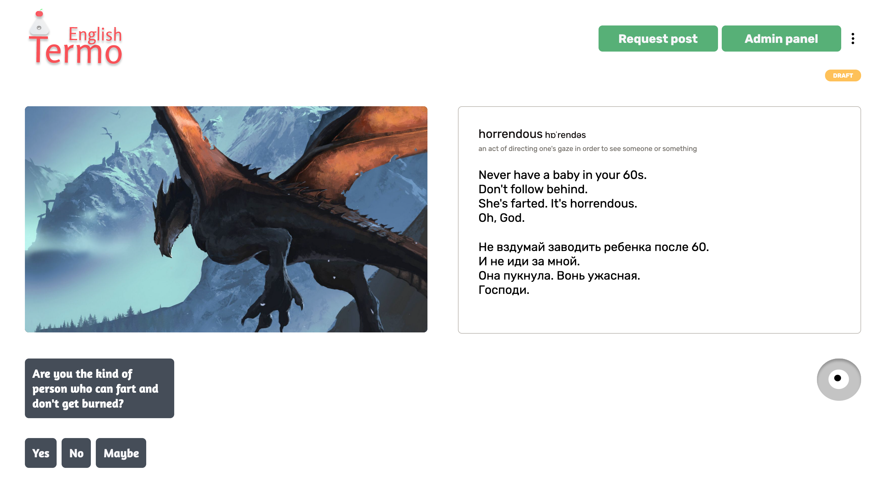
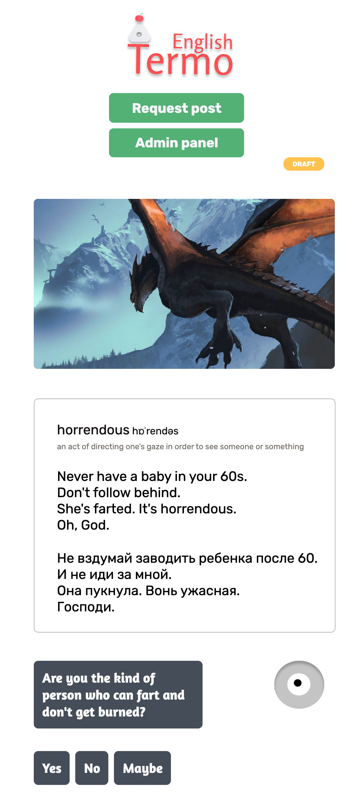
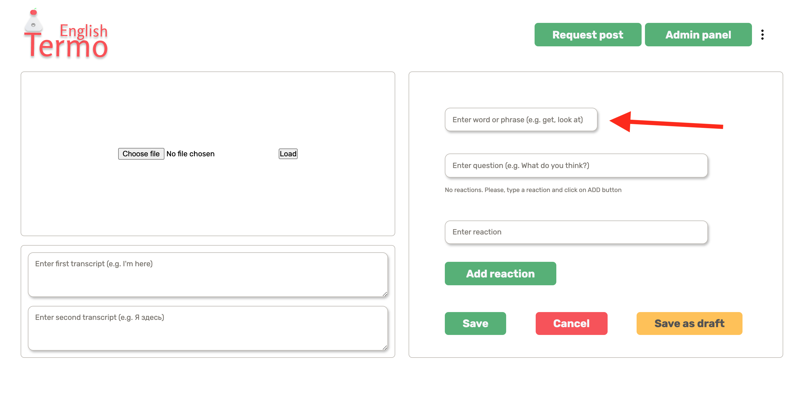
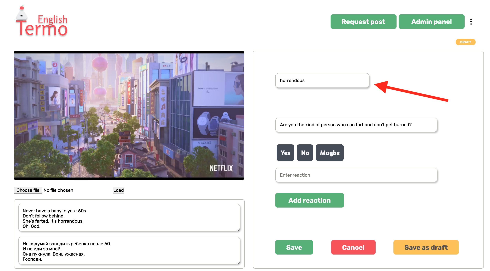
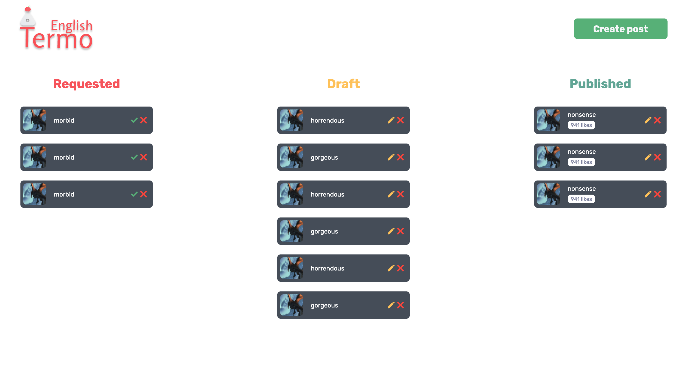
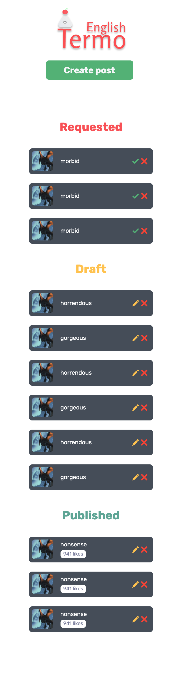

Hi, 👋 I hope you had and having a tremendously powerful week of new things and achievements

## Intro

Let's start with the question "Why didn't I publish the blog post on Sunday?". The reason is quite simple. I didn't manage my time properly and I procrastinated. So, I figured the problem and here we are😜

First of all, I want to highlight and remind you that app design is changing every single time because even after you think it is ready some UI and UX inconsistencies pop up. It's a natural continuous improvement because we are people and we cannot manage everything at once, so it's easier to refine things step by step, but I'm always thriving for the best result from the first time

I can proudly say that the previous week was quite productive because I managed to finish some UI/UX stuff and design refinement. Ok, I think mere words don't mean anything for you, so let's get straight to the point

## Achievements

### Updated post page

I decided that it's not obvious what post the user is looking at right now, so I duplicated information from posts page to post page to make it obvious how the user wound up there. It consists of transcription, the meaning of the phrase or word, and the word or phrase itself. It looks better now. Isn't it?

<figure>
  
</figure>

<figure>
  
</figure>

### Updated create post page

I added an input field for entering the word or phrase. A red arrow will help you find the input ⬇️

<figure>
  
</figure>

### Updated edit post page

I added an input field for entering the word or phrase as well. Honestly, create and edit post pages are created using <a href="https://github.com/termoxin/thermo-english/tree/master/app/components/common-components/editing-post-layout" target="_blank">the same component</a>. A red arrow will help you find the input ⬇️

I don't like the fact that and inputs and buttons are scattered through the Galaxy. So, it makes sense to make it more organized and robust. If you have ideas on how to pull it off, feel free to let me know (in the comments below or the Telegram using the link on the very top of the page)

<figure>
  
</figure>

### Admin panel page

This is the page for administrators and content creators. On the page administrators and content creators can approve requested posts, edit or delete these. I'm not into "likes" as an engagement rate because it's too ubiquitous and versatile. So, it makes to have "eyes" instead of "likes". It's a bit unique one and I like it more

I'll keep you posted 💪 Stay tuned for more

<figure>
  
</figure>

<figure>
  
</figure>

## Next steps

1. Organize inputs and buttons in editing and creating post page to make it more robust and consistent
2. Make "eyes" instead of "likes" as engagement rate
3. Create a SDK for the mocked server to prepare for Firebase integration

I decided to use Firebase for MVP because it's going to be easier and faster to show the app to the world. Firebase has authentication, database and other useful services for the fast launch of any MVP

## Agenda

1. I'm still fuc\*king close to getting my driving license 🚙
2. I'm planning to start creating educational articles to share my experience as a developer and person. I have something special for y'all you're gonna be interested in
3. I finally fixed my sleeping hours, so the two things above most likely will happen shortly

## Conslusion

Be yourself is a crucial thing. Having a good sleep is a vital one

#### Do you think about the updated Thermo English design?

Best regards,
Ros ❤️
