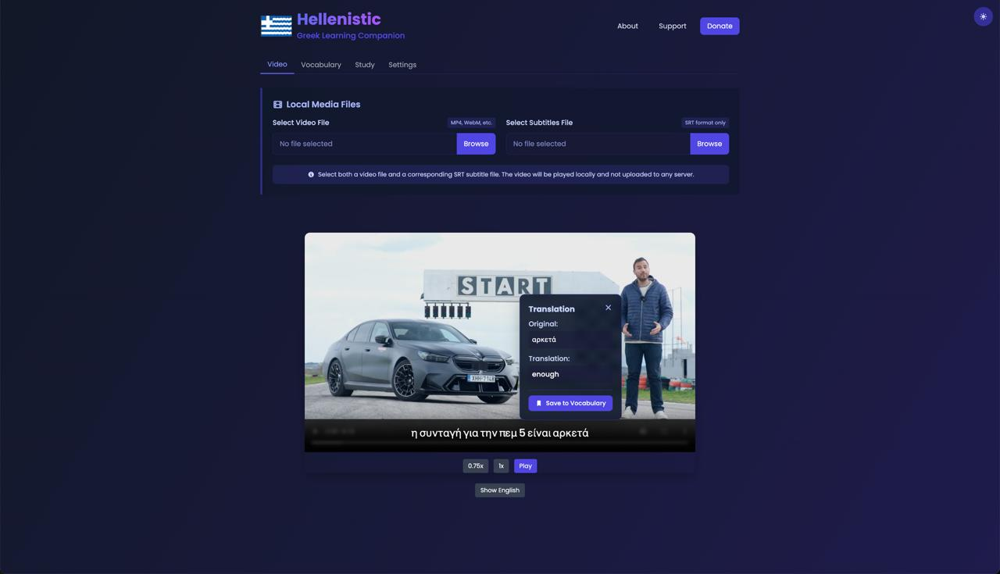

# Hellenistic: My Greek Learning Journey Companion

Hi everyone! I wanted to share a personal project that's been keeping me busy lately: **Hellenistic**, a little companion app I built to help with my own Greek language learning journey.

## Why I Built This

Learning Greek has been both fascinating and challenging for me. The different alphabet and grammar structures were tricky, and I often found myself struggling when watching Greek videos - pausing constantly, looking up words, and forgetting them later. I thought there must be a better way to learn from the content I enjoyed.

## What Hellenistic Does

Hellenistic is simply a tool that lets you watch videos with Greek subtitles while making it easier to understand and remember new words. It started as something just for me, but I figured others might find it helpful too.

## Some Things It Can Do

### 📺 Watch & Learn

- Load your own Greek videos and subtitle files
- See both Greek text and English translations if you want
- Slow down the playback when those native speakers get too fast!

### 🔤 Learn Words More Naturally

- Click on words you don't know to see what they mean
- Save interesting words to come back to later
- Build your vocabulary from content you actually enjoy

### 📚 Remember What You Learn

- The app uses a simple spaced repetition approach (basically, it reminds you of words just before you might forget them)
- It suggests reviewing a reasonable number of words daily
- You can see your progress as you learn more words

### ⚙️ Make It Work for You

- Set it up to pause after subtitles if that helps you
- Choose between light and dark themes
- Use keyboard shortcuts if you're into that

## How It's Built

I'm using some standard web tools:

- Next.js and React for the interface
- TailwindCSS for making it look decent
- Node.js for the behind-the-scenes stuff

## What's Next

I have some ideas I'd like to add when I have time:

- Better dictionary lookups
- Help with pronunciation
- Simple grammar explanations
- Maybe ways to share vocabulary with friends

## Give It a Try

If you're learning Greek too, you might find this helpful. It's available at [hellenistic.vercel.app](https://hellenistic.vercel.app).

I'd love to hear how it works for you and any ideas you have for making it better!

---

*Learning languages is more fun when we help each other. If you have thoughts or suggestions, I'd love to chat! Just visit the [Support](https://hellenistic.vercel.app/support) page.* 