# ❌ FAILED

**TODO**: text here why

<figure>
  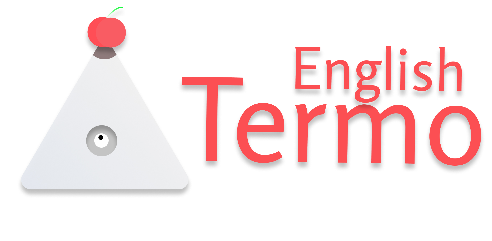
</figure>

<Spacer />

## What's Thermo English?

Hey, reader👋

I hope you're going to have a good read!

Originally, Thermo English is a Telegram channel that helps people to learn English using short movie clips and reactions. Using reactions you can answer the question below the transcript.

<figure>
  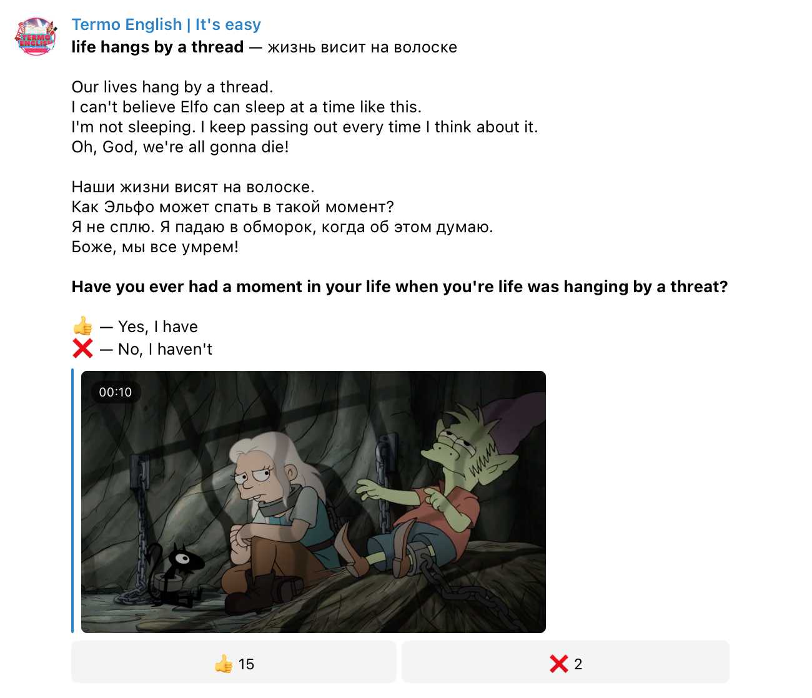
</figure>

As you can see on the screenshot above it is Termo English. It is because of a misspelling of _thermonuclear_ word, but in the further future, it'll be renamed Thermo English. _Thermonuclear_ because the channel and web platform can blow off your life to the moon. It can help you get your dream job, create international business or business abroad, travel to other countries, watch movies in original, read books in original and other stuff that you probably couldn't even dream of

English changed my life and I hope it is going to change yours. Just think about it a little bit, how many opportunities it'll open to you, how many new people you can meet. It's worth investing some time to learn it. A proper goal can help you with that. If you're interested in how to set a goal for learning English, to get motivation. Let me know, I'll create a whole blog post for you

## What's the problem Thermo English solves?

Everybody knows that in most schools and universities they don't teach us English, even most paid courses don't. People are getting afraid of English. They're starting to think about speaking fluently and confidently in English as something beyond fiction and an impossible thing to do, but honestly, it is not. Thermo English will change your mind

**Thermo English** offers a smooth and engaging English learning experience which is accomplished by a gaming-like educational process. You can learn new expressions, words just playing as a warrior who's going through the jungles or as a sorcerer who cleans caves of skeletons

If you don't like the game-like education process, you can simply learn English with interactive cards. It depends on your preferences, but I bet you, you're not going to regret it if you try both

## How much does it cost?

It is in development so far, but it's gonna be completely free. If you'd like to support the development, you can [buy me coffee](https://www.buymeacoffee.com/rostyslav) ☕️ or contribute to the project

It can be any kind of help. You can create a bug issue or feature issue or even create a pull request. I appreciate any help

Here's [Github repo](https://github.com/termoxin/thermo-english) where you can request a feature, report a bug, or even create a pull request

## Is it available for use?

The Thermo English Telegram channel is available roughly for 2 years in a row. I'm going to publish development progress posts in there every 2 weeks. If you'd like to become an investor of this amazing project, you're welcome!

The Thermo English web app is in development yet. I'm planning to release the first MVP version at the end of the summer at max

Also, don't forget that you can always contribute to the project using [Github](https://github.com/termoxin/thermo-english) or by contacting me using [Telegram](https://t.me/termoxin)

## A little bit about the application

I want to remind you that's in development for now and MVP is not ready, so a lot of things can change, but I'm happy to share with you things that have been already done so far. Let me walk you through designs and introduce you to each piece of functionality

### Authentication/Log in page

This is the place where your journey as an English learner and a person that has courage, begins. Here you'll able to Sign In & Sign Up and start ~~using the app~~ change your life

It is pretty straightforward. You can Sing Up using your Google account or simply using email and password approach

<figure>
  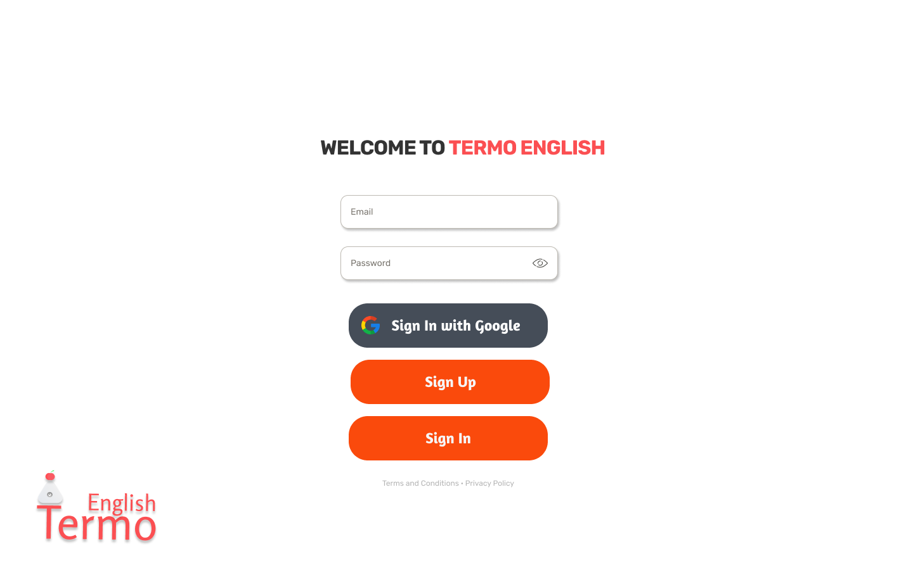
</figure>

### Posts page

This is where your life begins to be transformed. This page is available after you're signed in

Features:

1. Watch short movie clips, see expressions or words and their meanings
2. You can load more posts by clicking on the "Load more" button
3. If you want to propose your post you can click on "Request post"
4. "Admin panel" button is for an administrator to manage requested posts, edit and delete them
5. If you're interested to find a specific phrase or word you can use the search input
6. If you're interested in the most popular, recent, oldest posts. You can click on filter buttons (e.g., Popular, Recent)

<figure>
  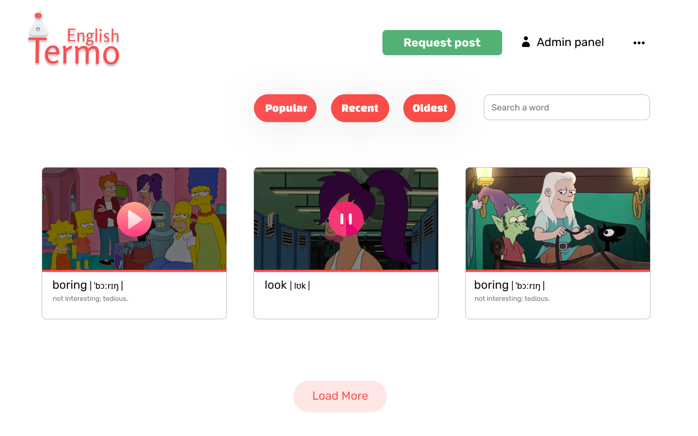
</figure>

### Post page

This is the most interesting and useful page in the app. Most of the features are gonna be here

On this page, you can answer the question using reaction buttons. It'll help you reinforce what you've learned. It has a like indicator. This is an eye in the lower-right corner of the screenshot. It will follow you until you like it 👀

In the middle-right corner of the screen, you can see double-transcript. Where the first language is going to be e.g. English and the second one is going to be e.g. Russian. It serves to help you navigate through the transcript

<figure>
  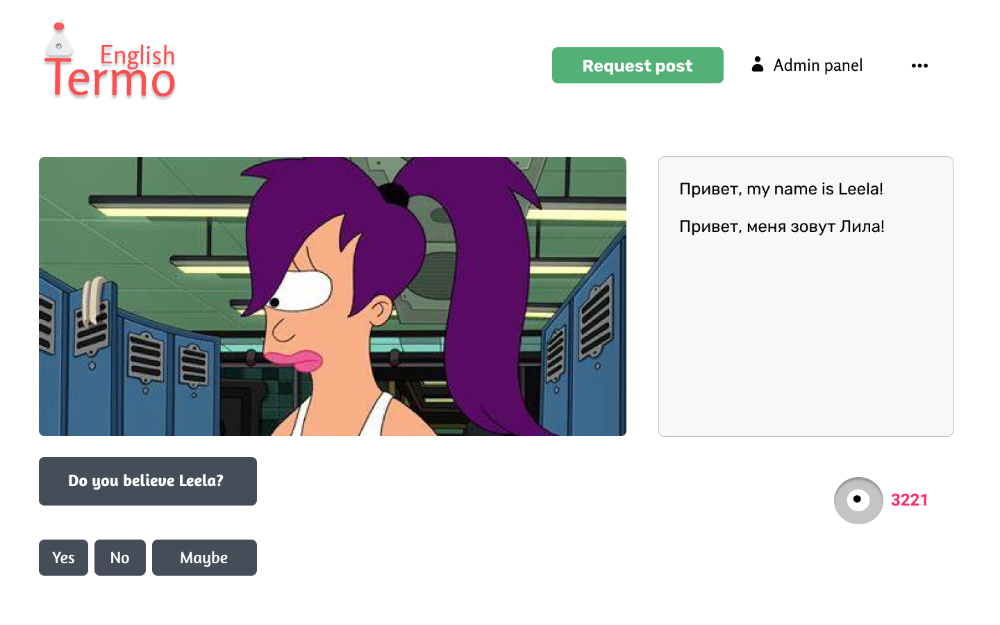
</figure>

Do you want to watch and listen how your favorites movie actors or cartoon characters are speaking? It has a video player to playback the short movie cuts. To make your learning more productive it is good to watch a short movie clip and react to the question below the video player

<figure>
  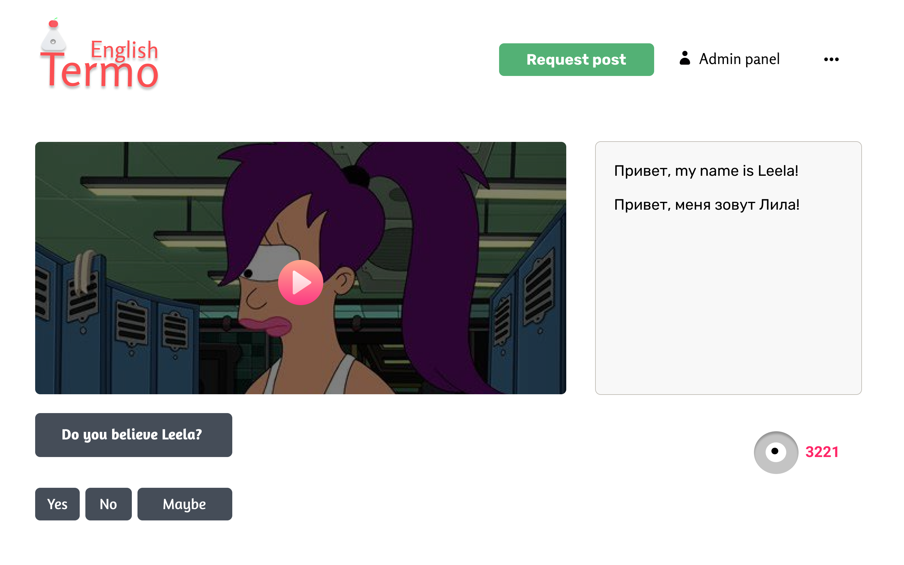
</figure>

When you're posting is in the draft it'll have the draft tag. It is an orange circled rectangle in the top-right corner of the screenshot

<figure>
  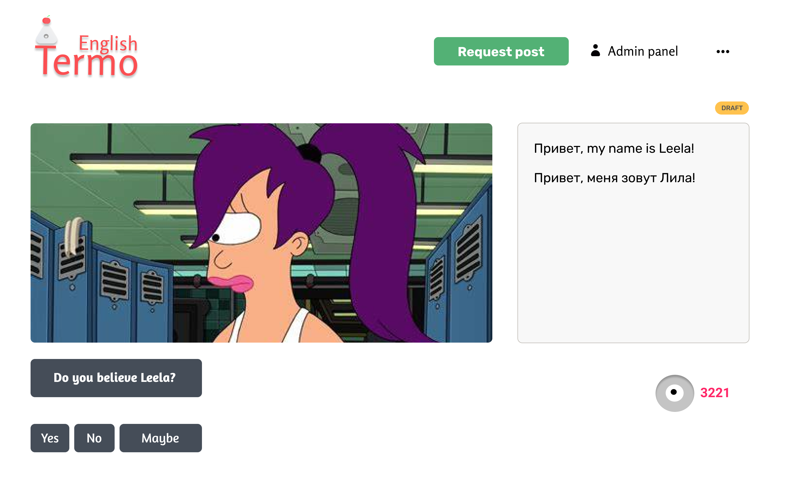
</figure>

The same tag we have for "Requested" and "Published posts"

<figure>
  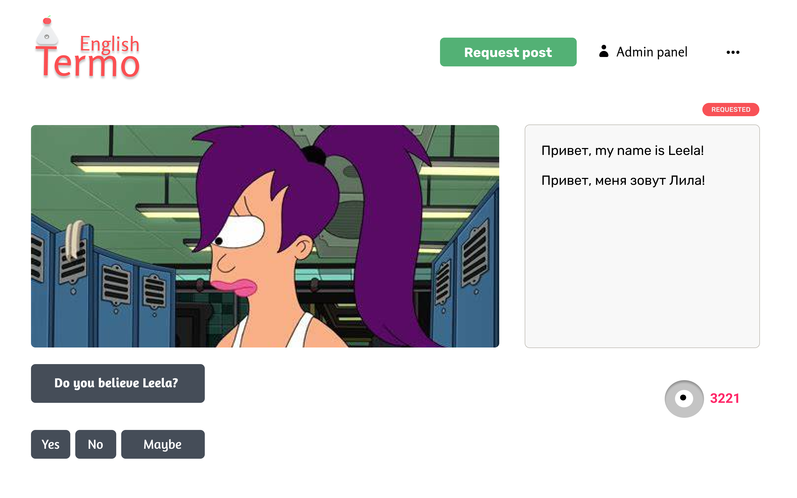
</figure>

### Admin panel

This is the place where creators can get their posts approved

The simple admin panel serves to approve requested posts, edit and delete posts and see how many likes published posts have. Also, it possible to delete a post using the cross icon or edit it by clicking on the pencil icon

<figure>
  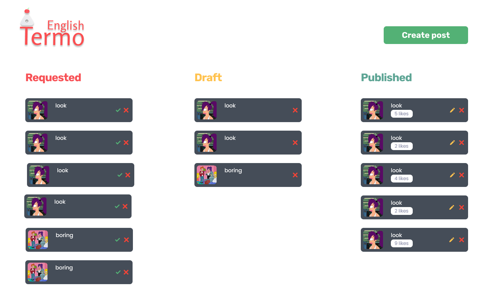
</figure>

### Create post

You go to the page when you click on the "Request post" button. Here you can save the post as a draft, save it or cancel and it'll be gone and you will be redirected to the posts page

<figure>
  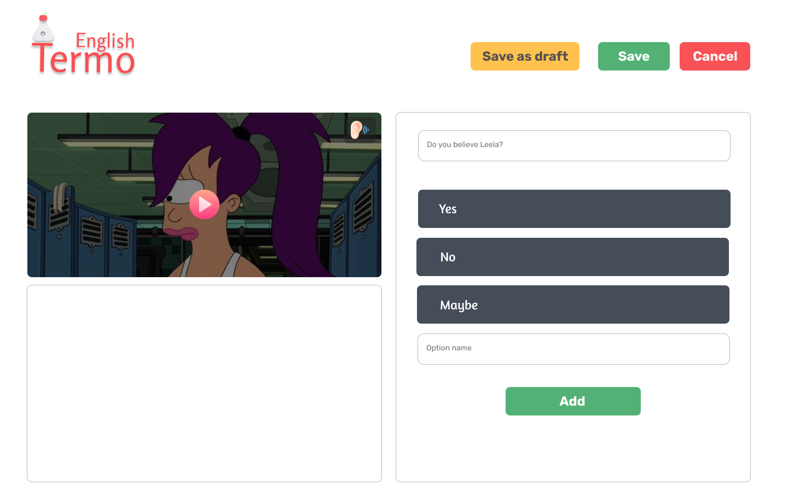
</figure>

### Edit post

Here a user can edit a post. You can get here by clicking on the pencil icon in the admin panel

Also, it will have an amazing and exciting feature. When you click on 👂 an icon on the top-right corner of the video player AI(Artificial Intelligence) will detect speech and create a transcript for you automagically. The create post page has the same feature. It is exciting. Isn't it?

<figure>
  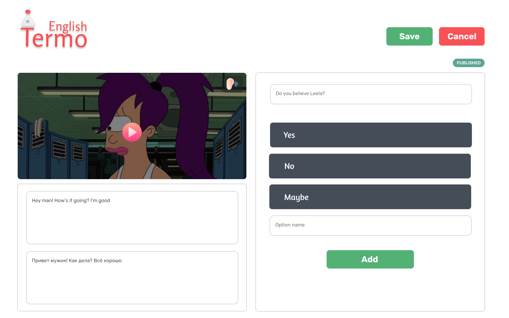
</figure>

### 404 page

I think that speaks for itself. You're going to be redirected to the page when a specific page is not found. I hope you're never going to see this one 😁

<figure>
  
</figure>

<Divider />

### Other hustle

This is what has been done so far. I know that there are a lot of things that are going to be done. I'm sure that I'm on the right way to make this world a better place just by making people's life better and easier

As I previously wrote in this blog, I'll update you guys every week about the progress I'm doing for the Thermo English project

## Conslusion

1. Thermo English is gonna be fully available at the end of the summer
2. If you want to contribute, make the project available asap, test or give your feedback, please, do this here → [Github repo](https://github.com/termoxin/thermo-english) or contact me through [Telegram](https://t.me/termoxin)
3. You can request any feature you want, just by creating an issue in Github or texting me personally

<Spacer />
<Divider />

#### What do you want me to create a progress timeline of Thermo English in the blog?

It'll help you and me to get track of where I'm and what should be done. Please, leave your feedback in the comments below. I wish you good luck and things you want to bring up! See you in the next one!

Best regards,
Ros ❤

